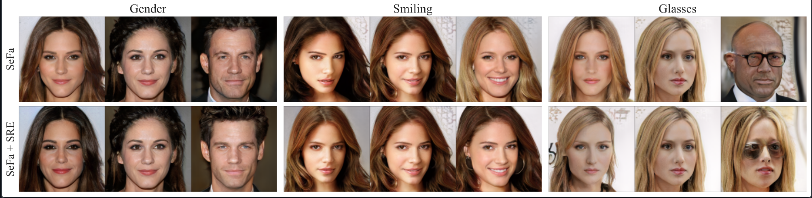
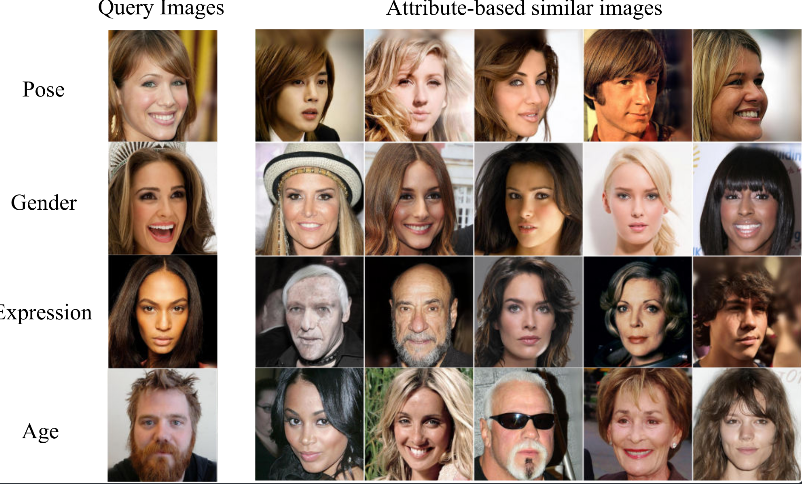

# Self-supervised Enhancement of Latent Discovery in GANs
[Paper](link)

Self-supervised Enhancement of Latent Discovery in GANs. \
[Silpa V S*](silpavs.43@gmail.com), [Adarsh K*](kadarsh22@gmail.com), [S Sumitra](https://www.iist.ac.in/mathematics/sumitra)
* *indicates equal contribution.
*AAAI 2022*

## Prerequisites
- Ubuntu
- Python 3
- NVIDIA GPU + CUDA CuDNN

## Abstract
Several methods for discovering interpretable directions in the latent space of pretrained GANs have been proposed. Latent semantics discovered by unsupervised methods are relatively less disentangled than supervised methods since they do not
use pre-trained attribute classifiers. We propose Scale Ranking Estimator (SRE),which is trained using self-supervision. SRE enhances the disentanglement in directions obtained by existing unsupervised disentanglement techniques. These directions are updated to preserve the ordering of variation within each direction in latent space.We also show that the learned SRE can be used to perform Attribute-based image retrieval task without further training.


<a name="setup"/>
<a name="application"/>

## Setup

- Clone this repo

- Install dependencies:
	- Install dependencies to a new virtual environment.
	```bash
	pip install -r requirements.txt
	```
 
## Discovered directions


## Application - Attribute based Image Retrieval


